# SnackTrack — System Architecture

This document provides a visual overview of SnackTrack's architecture, key workflows, and data flow. It explains how the frontend, backend, database, and external services interact.

---

## 🏗 High-Level System Overview

SnackTrack is a monolithic MERN stack application built for simplicity and reliability.

```mermaid
graph TD
    %% Styling
    classDef client fill:#f9d5e5,stroke:#333,stroke-width:2px;
    classDef server fill:#eeeeee,stroke:#333,stroke-width:2px;
    classDef db fill:#d4e157,stroke:#333,stroke-width:2px;
    classDef external fill:#b3e5fc,stroke:#333,stroke-width:2px;

    subgraph Client [Frontend (React SPA)]
        direction TB
        UI_Auth[Login Page]:::client
        UI_Bill[Billing Page (Local Cart)]:::client
        UI_Orders[Orders Page (Fetch-on-Action)]:::client
        UI_Dash[Dashboard (Visualizations)]:::client
    end

    subgraph Server [Backend (Node.js / Express)]
        direction TB
        API_Gateway[API Routes]:::server
        
        subgraph Middleware
            Auth_MW[Auth Middleware (JWT)]:::server
            RBAC_MW[RBAC Middleware (Owner/Staff)]:::server
        end
        
        subgraph Controllers
            Ctrl_Auth[Auth Controller]:::server
            Ctrl_Order[Order Controller]:::server
            Ctrl_Dash[Dashboard Controller]:::server
        end

        subgraph Background_Services
            Cron[Node-Cron Scheduler (10 PM IST)]:::server
            Svc_Summary[Summary Service]:::server
            Svc_Telegram[Telegram Service]:::server
        end
    end

    subgraph Database [MongoDB]
        DB_Users[(Users Collection)]:::db
        DB_Orders[(Orders Collection)]:::db
    end

    Ext_Telegram[Telegram API]:::external

    %% Interactions - Login Flow
    UI_Auth -->|POST /auth/login| API_Gateway
    API_Gateway --> Auth_MW
    Auth_MW --> Ctrl_Auth
    Ctrl_Auth --> DB_Users

    %% Order Creation Flow
    UI_Bill -->|POST /orders| API_Gateway
    API_Gateway --> RBAC_MW
    RBAC_MW --> Ctrl_Order
    Ctrl_Order --> DB_Orders

    %% Dashboard / Analytics Flow
    UI_Dash -->|GET /dashboard/summary| API_Gateway
    RBAC_MW --> Ctrl_Dash
    Ctrl_Dash -->|Query & Compute in JS| DB_Orders

    %% Background Job Flow
    Cron -->|Daily Trigger| Svc_Summary
    Svc_Summary -->|Aggregate Stats| DB_Orders
    Svc_Summary -->|Format Report| Svc_Telegram
    Svc_Telegram -->|POST /sendMessage| Ext_Telegram
```

---

## 🔄 Key Workflow Diagrams

### 1. "Fetch-on-Action" State Consistency
SnackTrack uses a simple **Fetch-on-Action** pattern instead of complex WebSockets to keep the UI consistent.


### 2. High-Speed Billing Workflow
The billing flow uses **local state** aggressively to ensure zero latency while adding items.


### 3. Automated Daily Reporting
How the system autonomously reports earnings without user intervention.

```mermaid
sequenceDiagram
    participant Clock as Node-Cron (22:00 IST)
    participant Job as Daily Summary Job
    participant Svc as Summary Service
    participant DB as MongoDB
    participant TG_Svc as Telegram Service
    participant Telegram as External Telegram API
    participant Owner

    Note over Clock: 10:00 PM Every Night
    Clock->>Job: Trigger Job Execution
    Job->>Svc: Request Daily Stats
    
    Svc->>DB: Query: Paid Orders Today
    DB-->>Svc: [Order1, Order2, ...]
    Svc->>Svc: Compute Earnings, Top Snack
    Svc-->>Job: Summary Object { earnings: 5000, ... }
    
    Job->>TG_Svc: sendTelegramMessage(formattedText)
    TG_Svc->>Telegram: HTTP POST /sendMessage
    Telegram-->>Owner: 📱 "Namasthe Boss... Earnings: ₹5000"
```



---

## 🧩 Component Responsibilities

| Component | Responsibility | Key Tech / Pattern |
|---|---|---|
| **Frontend State** | Ephemeral UI state (cart, forms) | React `useState`, Local-Only Cart |
| **API Layer** | Routing, Request Validation | Express.js, REST |
| **Auth** | ID Verifiction, Role Checking | JWT, Custom Middleware Chain |
| **Database** | Persistent Storage | MongoDB, Mongoose |
| **Background Jobs** | Scheduled Tasks | `node-cron` (In-Process Scheduler) |
| **Analytics** | Business Intelligence | computed in Node.js (Controller Layer) |
